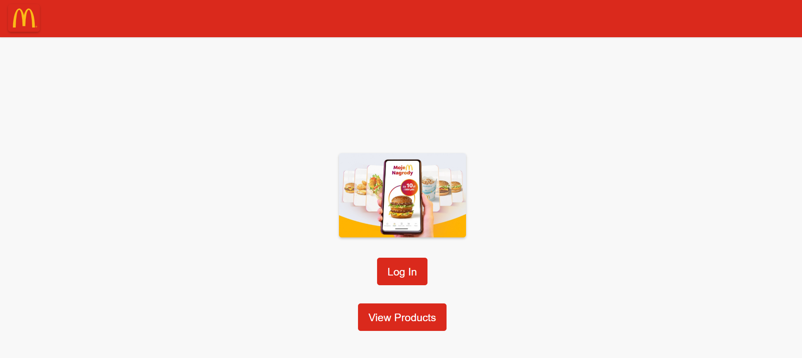
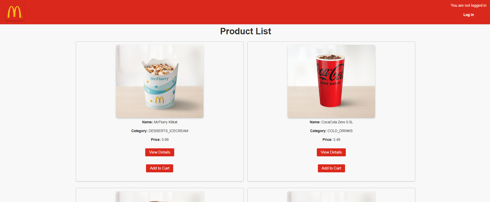
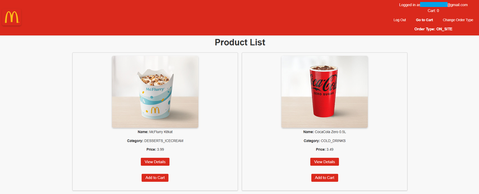
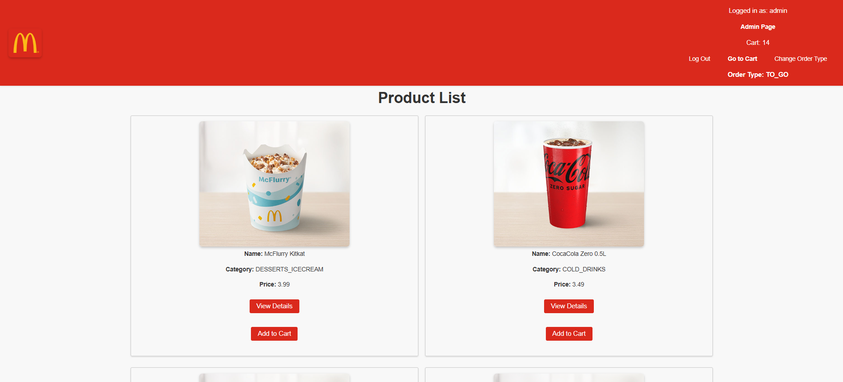
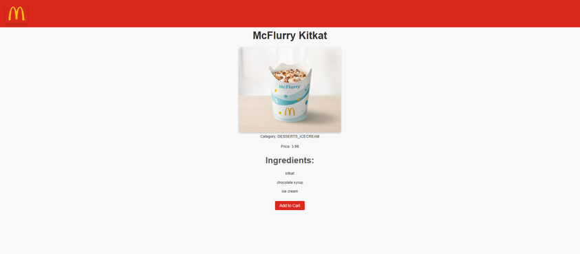
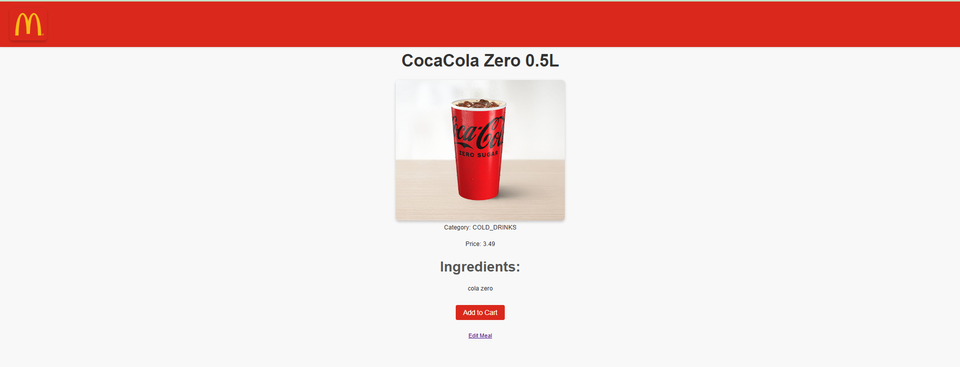
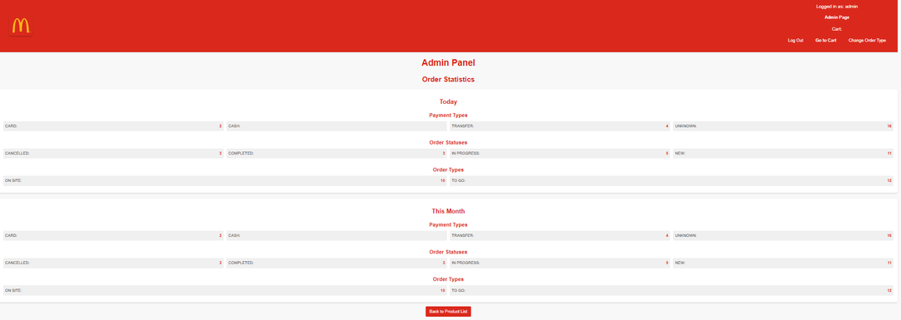
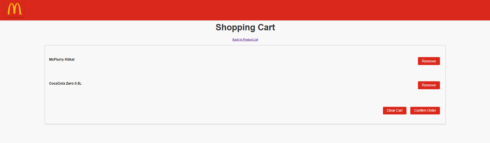
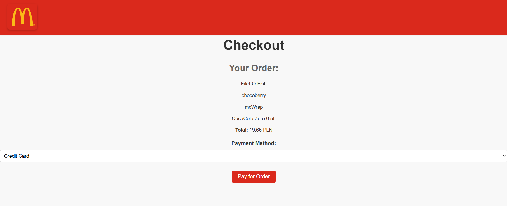
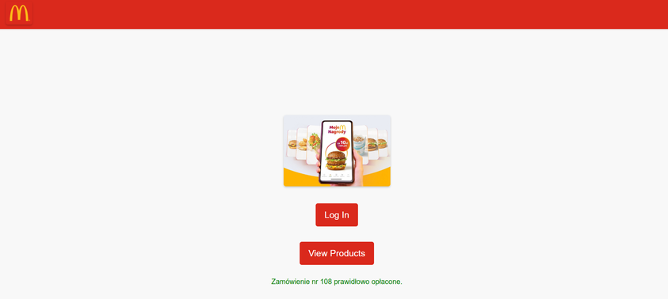

# McKiosk

## Table of Contents
1. [Description](#description)
2. [Concepts Used](#concepts-used)
3. [Walkthrough](#walkthrough)
4. [Setup](#setup)

## Description
**McKiosk** is a web application designed to simulate the experience of browsing and purchasing meals, inspired by McDonald's. Built entirely in **Java**, the project leverages **Spring Boot** for the backend, **Thymeleaf** for server-side rendering, and **Maven** for dependency management.
For those interested in a modern frontend approach, a streamlined version of this project is available with **Angular** as the frontend framework: [AngularKiosk](https://github.com/mhermannn/angularKiosk).
The application connects to a **PostgreSQL database** to manage data such as meals, ingredients, orders, and users, providing a seamless and interactive experience for both customers and administrators.

## Concepts Used
### Backend:
- **Spring Boot**: A powerful framework for building Java-based web applications, providing a robust backend for the project.
- **Spring Security**: Handles authentication and authorization, ensuring secure access based on user roles (e.g., User vs. Admin).
- **Google OAuth2**: Enables users to log in using their Google accounts for a seamless authentication experience.
- **Session Management**: Tracks user sessions, maintaining shopping cart state and current order details.
- **RESTful APIs**: Exposes endpoints for managing meals, orders, and users, allowing for integration with other systems or frontends.
- **Spring Beans**: Manages application components using dependency injection, ensuring modular and testable code.
### Frontend:
- **Thymeleaf**: A server-side templating engine used for rendering dynamic HTML content.
- **Responsive Design**: Ensures the application works seamlessly across different devices and screen sizes.
- **Dynamic Content Rendering**: Uses Thymeleaf to dynamically render content based on user authentication status and role.

### Database & Data Management:
- **PostgreSQL**: A relational database used to store and manage data such as meals, orders, users, and ingredients.
- **Maven**: A build automation tool used for managing project dependencies and building the application.
- **Order Management**: Tracks orders with various statuses (e.g., New, In Progress, Completed, Cancelled) and payment methods (e.g., Cash, Card, Transfer).
- **Shopping Cart Functionality**: Allows users to add, remove, and clear items from their cart, with real-time updates to the order status.

### Security & Validation:
- **Form Validation**: Ensures data integrity by validating user inputs, such as meal details and payment information.
- **Error Handling**: Provides meaningful error messages and redirects users when issues arise (e.g., insufficient funds, invalid login).
- **Role-Based Access Control (RBAC)**: Restricts access to specific features (e.g., Admin Page) based on user roles.

### Analytics & Insights:
- **Statistical Data Analysis**: Provides insights into order trends, such as payment methods, order types, and statuses, helping business owners make informed decisions.

## Walkthrough with Images

### 1. Welcome Page

The welcome page provides users with the option to either log in or browse available meals without logging in. Unauthenticated users can view the meal selection but cannot access detailed information. Additionally, clicking on the advertisement redirects users to the relevant page on **mcdonald.pl**.

---

### 2. Login Page

Users can log in using their credentials. If incorrect details are entered, an error message appears prompting them to try again. Upon successful login, users are redirected to the **Order Type Page**.

#### Login Methods:
- **Username & Password**
- **Google OAuth2**

#### Account Types:
- **User Account**: Limited access to features.
- **Admin Account**: Full access, including administrative functionalities.

---

### 3. Order Type Page

After logging in, an order is automatically created. Users are prompted to select whether they want their order **to go** or **on-site**. After making a selection, they are redirected to the **Meals Page** with full functionality enabled.

---

### 4. Meals Page
#### When Not Logged In

Unauthenticated users can:
- Browse the meal selection.

#### When Logged In as a User

Authenticated users can:
- Browse available meals.
- View detailed meal information by clicking **See More**.
- Add meals to their cart.

##### Header Elements:
- **Logo (Left)**: Clickable link to return to the homepage.
- **Login Display (Right)**: Displays the user's login or email, depending on the chosen login method.
- **Cart Information (Right)**:
    - Displays the number of items in the cart.
    - **Go to Cart** button to view cart details in the **Shopping Cart Page**.
- **Logout Button**.
- **Order Type Switch Button**: allows users to change their order type.
- **Current Order Type**

#### When Logged In as an Admin

Admins have all user functionalities, plus access to the **Admin Page** via an additional button in the header (right below the login display).

---

### 5. Meal Page
#### When Logged In as a User

Users can:
- View meal ingredients.
- Add meals to their cart.

#### When Logged In as an Admin

Admins can:
- View meal ingredients.
- Add meals to the cart.
- **Edit meal details** (via a separate edit page, with validation requirements).


---

### 6. Admin Page

The Admin Page provides statistical data on recent orders, categorized into:
- **Today's Orders**
- **Current Month's Orders**

#### Order Data Includes:
- **Order ID & User ID** (used for tracking orders).
- **Order Creation Date** (automatically added by PostgreSQL).
- **Order Type** (To-Go / On-Site) – Helps track customer preferences.
- **Order Status**:
    - `New`: Order created but no meal added.
    - `In Progress`: At least one meal added (even if later removed).
    - `Completed`: Successfully paid.
    - `Cancelled`: Insufficient funds.
- **Payment Type**:
    - `Unknown`: Order abandoned before payment.
    - `Cash`, `Card`, or `Transfer` – Helps analyze customer payment preferences.

This data helps business owners track abandoned orders, preferred payment methods, and dining preferences.

---

### 7. Shopping Cart Page

The shopping cart page allows users to:
- View items in their cart.
- Remove individual items or clear the entire cart.
- Proceed to checkout by clicking **Confirm Order**.

---

### 8. Checkout Cart Page

On the checkout page, users can:
- Review their order.
- Choose a payment method: **Cash, Card, or Transfer**.
- Complete the payment by clicking **Pay for Order**.

#### Possible Payment Outcomes:
**Successful Payment**

- Redirects to the Welcome Page with a confirmation message.
- A new order is automatically created with the same preferences as the previous one, allowing for easy reordering while still being fully customizable.

**Unsuccessful Payment (Insufficient Funds)**

- Redirects to the Insufficient Funds page.
- A new order is automatically created with the same preferences and cart items for convenience.

---
## Setup & Installation

### 1. Prerequisites
Ensure you have the following installed on your system:
- **Java 17** (Check with `java -version`)
- **Maven** (Check with `mvn -version`)
- **PostgreSQL** (Ensure it’s running and accessible)

### 2. Clone the Repository
```sh
git clone https://github.com/mhermannn/McKiosk.git
cd McKiosk  
```

### 3. Configure the Database
Start PostgreSQL and create the required database:
```sql
CREATE DATABASE kioskdb;
```
Then, execute the following SQL script to create necessary tables:
```sql
CREATE TABLE orders (
    order_id SERIAL PRIMARY KEY,
    customer_id INT NOT NULL,
    order_type VARCHAR(20) NOT NULL,
    order_status VARCHAR(20) NOT NULL,
    order_payment_type VARCHAR(20) NOT NULL,
    created_at TIMESTAMP DEFAULT CURRENT_TIMESTAMP
);

CREATE TABLE order_shopping_cart (
    order_id INT NOT NULL,
    meal_name VARCHAR(255),
    FOREIGN KEY (order_id) REFERENCES orders(order_id)
);

CREATE TABLE users (
    id SERIAL PRIMARY KEY,
    login VARCHAR(255) UNIQUE NOT NULL,
    password VARCHAR(255),
    resources DOUBLE PRECISION,
    role VARCHAR(20) DEFAULT 'USER'
);
```
(Optional) Insert some test users:
```sql
INSERT INTO users (id, login, password, resources, role) VALUES
(1,'admin', '$2a$10$.y7leRFZlh6oy5QERWh3Ze5VPq952eM5o04.OHhQdXkcktRNN3GsW', 100.00, 'ADMIN'),
(2, 'user', '$2a$10$epkHllT/D2ukbWTQygiNrOVjV7X8w.vsbtEHZKlcIm3.dFqq61zma', 10.00, 'USER');
```
In this example, the user account password is set to "user," while the admin account password is "admin." It's important to note that the passwords are already encoded in the database. If you'd like to use a different password, you can utilize the **BcryptPasswordGenerator** in the config folder to see how the passwords will appear after being encrypted.
### 4. Configure `application.properties`
Update `src/main/resources/application.properties` with your database credentials:
```properties
spring.datasource.url=jdbc:postgresql://localhost:5432/kioskdb
spring.datasource.username=your-username
spring.datasource.password=your-password
spring.jpa.hibernate.ddl-auto=update
spring.jpa.show-sql=true
spring.jpa.database-platform=org.hibernate.dialect.PostgreSQLDialect
```
For **Google OAuth2**, configure your credentials:
```properties
spring.security.oauth2.client.registration.google.client-id=your-client-id
spring.security.oauth2.client.registration.google.client-secret=your-client-secret
```
Ensure that the Google OAuth2 user is added to the users table. Use the Google account's ID number as the login, leave the password field blank, and fill out the remaining fields as needed

### 5. Build & Run the Application
Use Maven to build and run the project:
```sh
mvn spring-boot:run
```
The application should now be running at **http://localhost:9393**

---

Thank you for reading to the end! 😊
